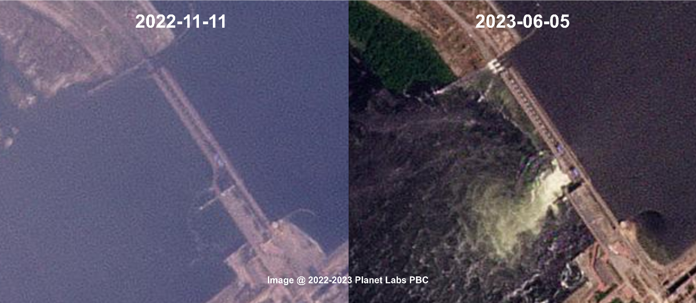

## Avoidable Danger? Once Upon a Time in Kakhovka
- Operational mishaps might linked to hydrological danger prior to Kakhovka Dam collapse
 

   
 <!-- Set width to 60% for the figure -->
    <a>
       <!-- Adjust width for larger figure -->
    </a>
  

  
 <!-- Set width to 40% for text and add margin for spacing -->
    

      Before the breach of Kakhovka Dam in Ukraine, on June 6 2023, the spillway ancillary structure shown signs of compromised and water ran over the top of sluice gates (overtopping). With a comprehensive analysis of the sattelite data, streamflow simulation, and dam design paramerters, we trace the operation anomalies back to Novermber 11, 2022. Started from late Novermber 2022, the outflow of Kakhovka Dam was unregulated and lead to extremely low water level in late January and overtopping started from late April 2023. After suffering a month long overflow, the spillway ancillary structures started showing signs of compromised near the stucked open sluice gates' location. This study showcase how remote sensing tecghinques can reshape the hazard awareness of our water system.
    

  

- Paper: [Yang, Q., et al., Communications Earth & Environment, 2024](https://www.nature.com/articles/s43247-024-01397-5)
- Post: [Yang, Q., and Shen, X., Behind the Paper, 2024](https://communities.springernature.com/posts/avoidable-danger-once-upon-a-time-in-kakhovka?channel_id=behind-the-paper)