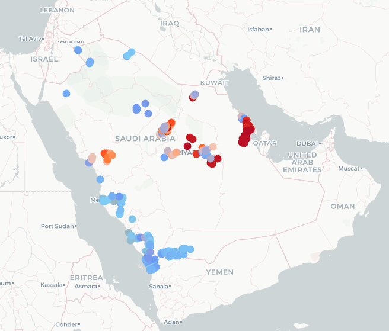
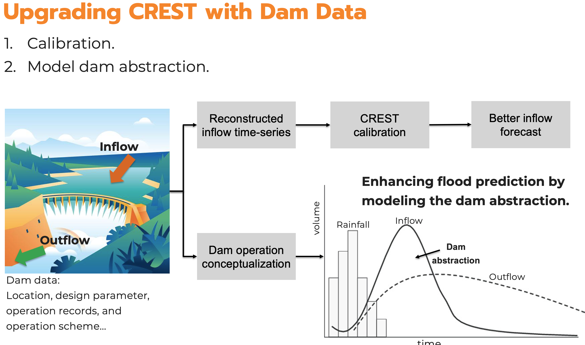

## A Nationwide Flash Flood Forecasting System
 

   
 <!-- Set width to 60% for the figure -->
    <a>
       <!-- Adjust width for larger figure -->
    </a>
  

  
 <!-- Set width to 40% for text and add margin for spacing -->
    

      Collaborated with Meteologists, Hydraulicists, IT experts, and local agencies, we developed a national-scale flash flood forecast system for Saudi Ariabia. The operational system incorporates three components: an atmospheric model, a hydrological model, and a hydrodynamic model. Reponsible for the hydrological part, which utilizes a distributed model to simulate the rainfall-runoff and routing processes, producing flood warning based on quantile level. The system provides unprecedented spatial coverage and timely forecast information to the forecasters and emergency responders. It might also be a gateway to better understand the flash flood process over desert area.
    

  

- Conference proceeding: [Sofia, G., Yang, Q., Shen, X., et al., EGU23](https://meetingorganizer.copernicus.org/EGU23/EGU23-7434.html)
- Journal paper: in submission.
- Hydrological model tutorial: [Yang, Q., 2023](https://github.com/QingYang6/CREST_tutorial)

In the upcoming phase, we are integrating a reservoir module into the system to incorporate dam abstraction effects, enhancing our capability for more accurate flash flood forecasting.

